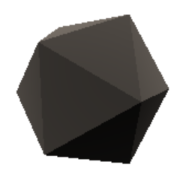

# UnunuraCSS

<p align="center">
  <a href="https://ununura.com/">
    
  </a>
  <p align="center">
    A Real CSS Engine. Only Scoped.
  </p>
  <p align="center">
  
  
</p>
</p>


## Features

- [Vue](./packages/vite/README.md), [React/Preact/Vue-JSX](./packages/vite/README.md), [Nuxt](./packages/nuxt/README.md), [Astro](./packages/astro/README.md) and [Svelte](./packages/vite/README.md);
- [Fontaine](https://github.com/danielroe/fontaine) and [PostCSS](https://postcss.org/) integrated;
- 0kb default injected .css;
- Only scoped and JSX-Scoped;
- Class-raw based;
- Extend API;
- Dynamic identifiers with unique/multiple engine;
- Nullable options/classes;
- External contexts (fonts/public files...).

## Simple Example

```html
<main class="reset:meyer">
  <div class="flex[col h-center v-center] border[2 white solid] bg:black w:100% h[min 100vh] scroll[y auto]">
    <p class="text[arial white 2rem 700]">Hello UnunuraCSS!</p>
  </div>
</main>
```

## Documentation

### Access [ununura.com](https://ununura.com) for more explanations.